# Lung Cancer Survival Analysis
Andrew Kinsman  
June 7, 2016  


## Data Description

Source: http://www.mayo.edu/research/documents/lunghtml/DOC-10027247  

See also data description at https://stat.ethz.ch/R-manual/R-devel/library/survival/html/lung.html

* inst:	        Institution code
* time:	        Survival time in days
* status:	censoring status 1=censored, 2=dead
* age:	        Age in years
* sex:	        Male=1 Female=2
* ph.ecog:	ECOG performance score (0=good 5=dead)
* ph.karno:	Karnofsky performance score (bad=0-good=100) rated by physician
* pat.karno:	Karnofsky performance score as rated by patient
* meal.cal:	Calories consumed at meals
* wt.loss:	Weight loss in last six months

## Exploratory Data Analysis


```r
library(survival)

lung <- read.table("DOC-10027697.txt", na.strings = ".", colClasses="numeric") 
names(lung) <- c("inst", "time", "status", "age", "sex", "ph.ecog", "ph.karno", "pat.karno", "meal.cal", "wt.loss")
str(lung)
```

```
## 'data.frame':	228 obs. of  10 variables:
##  $ inst     : num  3 3 3 5 1 12 7 11 1 7 ...
##  $ time     : num  306 455 1010 210 883 ...
##  $ status   : num  2 2 1 2 2 1 2 2 2 2 ...
##  $ age      : num  74 68 56 57 60 74 68 71 53 61 ...
##  $ sex      : num  1 1 1 1 1 1 2 2 1 1 ...
##  $ ph.ecog  : num  1 0 0 1 0 1 2 2 1 2 ...
##  $ ph.karno : num  90 90 90 90 100 50 70 60 70 70 ...
##  $ pat.karno: num  100 90 90 60 90 80 60 80 80 70 ...
##  $ meal.cal : num  1175 1225 NA 1150 NA ...
##  $ wt.loss  : num  NA 15 15 11 0 0 10 1 16 34 ...
```

```r
lung$status <- lung$status-1 # redefine censoring status as 0 (censored) and 1 (dead)

summary(lung) 
```

```
##       inst            time            status            age       
##  Min.   : 1.00   Min.   :   5.0   Min.   :0.0000   Min.   :39.00  
##  1st Qu.: 3.00   1st Qu.: 166.8   1st Qu.:0.0000   1st Qu.:56.00  
##  Median :11.00   Median : 255.5   Median :1.0000   Median :63.00  
##  Mean   :11.09   Mean   : 305.2   Mean   :0.7237   Mean   :62.45  
##  3rd Qu.:16.00   3rd Qu.: 396.5   3rd Qu.:1.0000   3rd Qu.:69.00  
##  Max.   :33.00   Max.   :1022.0   Max.   :1.0000   Max.   :82.00  
##  NA's   :1                                                        
##       sex           ph.ecog          ph.karno        pat.karno     
##  Min.   :1.000   Min.   :0.0000   Min.   : 50.00   Min.   : 30.00  
##  1st Qu.:1.000   1st Qu.:0.0000   1st Qu.: 75.00   1st Qu.: 70.00  
##  Median :1.000   Median :1.0000   Median : 80.00   Median : 80.00  
##  Mean   :1.395   Mean   :0.9515   Mean   : 81.94   Mean   : 79.96  
##  3rd Qu.:2.000   3rd Qu.:1.0000   3rd Qu.: 90.00   3rd Qu.: 90.00  
##  Max.   :2.000   Max.   :3.0000   Max.   :100.00   Max.   :100.00  
##                  NA's   :1        NA's   :1        NA's   :3       
##     meal.cal         wt.loss       
##  Min.   :  96.0   Min.   :-24.000  
##  1st Qu.: 635.0   1st Qu.:  0.000  
##  Median : 975.0   Median :  7.000  
##  Mean   : 928.8   Mean   :  9.832  
##  3rd Qu.:1150.0   3rd Qu.: 15.750  
##  Max.   :2600.0   Max.   : 68.000  
##  NA's   :47       NA's   :14
```

```r
table(lung$status)
```

```
## 
##   0   1 
##  63 165
```

```r
table(lung$sex)
```

```
## 
##   1   2 
## 138  90
```

## Part 1 - Survival by Gender


```r
# KM survival model (by gender)
kmsurvival <- survfit(Surv(time, status) ~ factor(sex), data=lung)
kmsurvival
```

```
## Call: survfit(formula = Surv(time, status) ~ factor(sex), data = lung)
## 
##                 n events median 0.95LCL 0.95UCL
## factor(sex)=1 138    112    270     212     310
## factor(sex)=2  90     53    426     348     550
```

```r
head(summary(kmsurvival))
```

```
## $n
## [1] 138  90
## 
## $time
##   [1]  11  12  13  15  26  30  31  53  54  59  60  65  71  81  88  92  93
##  [18]  95 105 107 110 116 118 131 132 135 142 144 147 156 163 166 170 175
##  [35] 176 177 179 180 181 183 189 197 202 207 210 212 218 222 223 229 230
##  [52] 239 246 267 269 270 283 284 285 286 288 291 301 303 306 310 320 329
##  [69] 337 353 363 364 371 387 390 394 428 429 442 455 457 460 477 519 524
##  [86] 533 558 567 574 583 613 624 643 655 689 707 791 814 883   5  60  61
## [103]  62  79  81  95 107 122 145 153 166 167 182 186 194 199 201 208 226
## [120] 239 245 268 285 293 305 310 340 345 348 350 351 361 363 371 426 433
## [137] 444 450 473 520 524 550 641 654 687 705 728 731 735 765
## 
## $n.risk
##   [1] 138 135 134 132 131 130 129 128 126 125 124 123 121 120 119 117 116
##  [18] 115 114 113 112 111 110 109 108 106 105 104 103 102 100  97  96  94
##  [35]  93  92  91  89  88  86  83  80  78  77  76  75  74  72  70  67  66
##  [52]  64  63  61  60  59  57  56  54  53  52  51  48  46  44  43  42  41
##  [69]  40  39  37  36  35  34  33  32  29  28  27  25  24  22  21  20  19
##  [86]  18  17  16  15  14  13  12  11  10   9   8   7   5   3  90  89  88
## [103]  87  86  85  83  81  80  79  77  76  75  71  70  68  67  66  62  59
## [120]  57  54  51  47  45  43  42  39  38  37  36  35  33  32  30  26  25
## [137]  24  23  22  19  18  15  11  10   9   8   7   6   5   3
## 
## $n.event
##   [1] 3 1 2 1 1 1 1 2 1 1 1 2 1 1 2 1 1 1 1 1 1 1 1 1 2 1 1 1 1 2 3 1 1 1 1
##  [36] 1 2 1 2 1 1 1 1 1 1 1 1 1 1 1 1 1 1 1 1 1 1 1 1 1 1 1 1 1 1 1 1 1 1 2
##  [71] 1 1 1 1 1 1 1 1 1 1 1 1 1 1 1 1 1 1 1 1 1 1 1 1 1 1 1 1 1 1 1 1 1 1 1
## [106] 1 1 1 2 1 1 1 1 1 1 1 2 1 1 1 1 1 1 1 1 1 1 1 1 1 1 1 1 1 1 1 1 1 1 1
## [141] 1 1 1 1 1 1 1 1 1 1
## 
## $n.censor
##   [1] 0 0 0 0 0 0 0 0 0 0 0 0 0 0 0 0 0 0 0 0 0 0 0 0 0 0 0 0 0 0 0 0 0 1 0
##  [36] 0 0 0 0 0 2 3 0 0 0 0 0 2 0 2 0 1 0 1 0 0 1 1 0 0 0 0 3 1 0 0 0 0 0 0
##  [71] 0 0 0 0 0 0 2 0 0 1 0 1 0 0 0 0 0 0 0 0 0 0 0 0 0 0 0 1 1 0 0 0 0 0 0
## [106] 1 1 0 0 0 0 0 3 0 1 0 0 2 2 1 2 2 3 1 1 0 2 0 0 0 0 1 0 1 3 0 0 0 0 2
## [141] 0 2 3 0 0 0 0 0 0 1
## 
## $surv
##   [1] 0.97826087 0.97101449 0.95652174 0.94927536 0.94202899 0.93478261
##   [7] 0.92753623 0.91304348 0.90579710 0.89855072 0.89130435 0.87681159
##  [13] 0.86956522 0.86231884 0.84782609 0.84057971 0.83333333 0.82608696
##  [19] 0.81884058 0.81159420 0.80434783 0.79710145 0.78985507 0.78260870
##  [25] 0.76811594 0.76086957 0.75362319 0.74637681 0.73913043 0.72463768
##  [31] 0.70289855 0.69565217 0.68840580 0.68108233 0.67375887 0.66643540
##  [37] 0.65178847 0.64446500 0.62981807 0.62249460 0.61499467 0.60730724
##  [43] 0.59952125 0.59173526 0.58394926 0.57616327 0.56837728 0.56048316
##  [49] 0.55247625 0.54423034 0.53598442 0.52760967 0.51923491 0.51072286
##  [55] 0.50221082 0.49369877 0.48503739 0.47637600 0.46755423 0.45873245
##  [61] 0.44991067 0.44108889 0.43189954 0.42251042 0.41290791 0.40330540
##  [67] 0.39370289 0.38410038 0.37449787 0.35529285 0.34569034 0.33608783
##  [73] 0.32648533 0.31688282 0.30728031 0.29767780 0.28741304 0.27714829
##  [79] 0.26688354 0.25620820 0.24553286 0.23437227 0.22321169 0.21205110
##  [85] 0.20089052 0.18972994 0.17856935 0.16740877 0.15624818 0.14508760
##  [91] 0.13392701 0.12276643 0.11160584 0.10044526 0.08928468 0.07812409
##  [97] 0.06696351 0.05357081 0.03571387 0.98888889 0.97777778 0.96666667
## [103] 0.95555556 0.94444444 0.93333333 0.92208835 0.91070455 0.89932074
## [109] 0.87655313 0.86516932 0.85378551 0.84240171 0.83053689 0.81867208
## [115] 0.80663278 0.79459349 0.77051490 0.75808724 0.74523830 0.73216395
## [121] 0.71860536 0.70451505 0.68952537 0.67420259 0.65852346 0.64284433
## [127] 0.62636114 0.60987795 0.59339476 0.57691157 0.56042839 0.54344571
## [133] 0.52646303 0.50891426 0.48934064 0.46976701 0.45019339 0.43061976
## [139] 0.41104614 0.38941213 0.36777812 0.34325958 0.31205416 0.28084875
## [145] 0.24964333 0.21843791 0.18723250 0.15602708 0.12482167 0.08321444
```

```r
quantile(kmsurvival)
```

```
## $quantile
##                25  50  75
## factor(sex)=1 144 270 457
## factor(sex)=2 226 426 687
## 
## $lower
##                25  50  75
## factor(sex)=1 107 212 387
## factor(sex)=2 186 348 550
## 
## $upper
##                25  50  75
## factor(sex)=1 177 310 574
## factor(sex)=2 340 550  NA
```

```r
# Plot of KM estimated survival function (FIG.1)
library(survminer)
```

```
## Loading required package: ggplot2
```

```
## Loading required package: ggpubr
```

```
## 
## Attaching package: 'survminer'
```

```
## The following object is masked from 'package:ggpubr':
## 
##     theme_classic2
```

```
## The following object is masked from 'package:ggplot2':
## 
##     %+%
```

```r
ggsurvplot(kmsurvival, data=lung, title="Fig.1 - Survival Function \nfor Men vs. Women", legend.title = "Sex",
           xlab="Time in Days", ylab="Estimated Survival Probability",
           legend.labs = c("Male", "Female"))
```

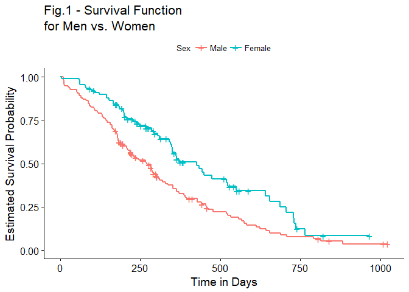<!-- -->

```r
# Plot of log(-log(S(t))), i.e. hazard function (FIG.2)  
ggsurvplot(kmsurvival, data=lung, fun="cloglog", title="Fig.2 - Log of Cumulative Hazard \nfor Men vs. Women", 
           xlab="log(Time in Days)", ylab="log-Cumulative Hazard", legend.title = "Sex",
           legend.labs = c("Male", "Female"))
```

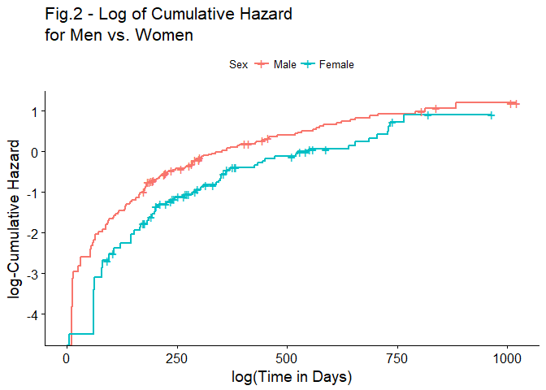<!-- -->

```r
# Log-rank test
survdiff(Surv(time, status) ~ factor(sex), data=lung, rho=0)
```

```
## Call:
## survdiff(formula = Surv(time, status) ~ factor(sex), data = lung, 
##     rho = 0)
## 
##                 N Observed Expected (O-E)^2/E (O-E)^2/V
## factor(sex)=1 138      112     91.6      4.55      10.3
## factor(sex)=2  90       53     73.4      5.68      10.3
## 
##  Chisq= 10.3  on 1 degrees of freedom, p= 0.00131
```

```r
# Survival probabilities for one and two years
summary(kmsurvival, times=c(365, 730))$surv
```

```
## [1] 0.33608783 0.07812409 0.52646303 0.18723250
```

## Part 2 - Fit Cox Proportional Hazards Model with all Covariates 


```r
lung.comp <- na.omit(lung) # listwise deletion
str(lung.comp) # no. of observations reduced from 228 to 167 after removing NAs
```

```
## 'data.frame':	167 obs. of  10 variables:
##  $ inst     : num  3 5 12 7 11 1 7 6 12 22 ...
##  $ time     : num  455 210 1022 310 361 ...
##  $ status   : num  1 1 0 1 1 1 1 1 1 1 ...
##  $ age      : num  68 57 74 68 71 53 61 57 57 70 ...
##  $ sex      : num  1 1 1 2 2 1 1 1 1 1 ...
##  $ ph.ecog  : num  0 1 1 2 2 1 2 1 1 1 ...
##  $ ph.karno : num  90 90 50 70 60 70 70 80 80 90 ...
##  $ pat.karno: num  90 60 80 60 80 80 70 80 70 100 ...
##  $ meal.cal : num  1225 1150 513 384 538 ...
##  $ wt.loss  : num  15 11 0 10 1 16 34 27 60 -5 ...
##  - attr(*, "na.action")=Class 'omit'  Named int [1:61] 1 3 5 12 13 14 16 20 23 25 ...
##   .. ..- attr(*, "names")= chr [1:61] "1" "3" "5" "12" ...
```

```r
summary(lung.comp)
```

```
##       inst            time            status            age       
##  Min.   : 1.00   Min.   :   5.0   Min.   :0.0000   Min.   :39.00  
##  1st Qu.: 3.00   1st Qu.: 174.5   1st Qu.:0.0000   1st Qu.:57.00  
##  Median :11.00   Median : 268.0   Median :1.0000   Median :64.00  
##  Mean   :10.71   Mean   : 309.9   Mean   :0.7186   Mean   :62.57  
##  3rd Qu.:15.00   3rd Qu.: 419.5   3rd Qu.:1.0000   3rd Qu.:70.00  
##  Max.   :32.00   Max.   :1022.0   Max.   :1.0000   Max.   :82.00  
##       sex           ph.ecog          ph.karno        pat.karno     
##  Min.   :1.000   Min.   :0.0000   Min.   : 50.00   Min.   : 30.00  
##  1st Qu.:1.000   1st Qu.:0.0000   1st Qu.: 70.00   1st Qu.: 70.00  
##  Median :1.000   Median :1.0000   Median : 80.00   Median : 80.00  
##  Mean   :1.383   Mean   :0.9581   Mean   : 82.04   Mean   : 79.58  
##  3rd Qu.:2.000   3rd Qu.:1.0000   3rd Qu.: 90.00   3rd Qu.: 90.00  
##  Max.   :2.000   Max.   :3.0000   Max.   :100.00   Max.   :100.00  
##     meal.cal         wt.loss       
##  Min.   :  96.0   Min.   :-24.000  
##  1st Qu.: 619.0   1st Qu.:  0.000  
##  Median : 975.0   Median :  7.000  
##  Mean   : 929.1   Mean   :  9.719  
##  3rd Qu.:1162.5   3rd Qu.: 15.000  
##  Max.   :2600.0   Max.   : 68.000
```

```r
cor(lung.comp[,c(4, 6:10)])
```

```
##                   age    ph.ecog    ph.karno  pat.karno    meal.cal
## age        1.00000000  0.3086538 -0.32261297 -0.2398974 -0.23958240
## ph.ecog    0.30865378  1.0000000 -0.82269739 -0.5471962 -0.10563039
## ph.karno  -0.32261297 -0.8226974  1.00000000  0.5350275  0.05385409
## pat.karno -0.23989736 -0.5471962  0.53502749  1.0000000  0.17465190
## meal.cal  -0.23958240 -0.1056304  0.05385409  0.1746519  1.00000000
## wt.loss    0.04286056  0.1712574 -0.12524032 -0.1821395 -0.11134425
##               wt.loss
## age        0.04286056
## ph.ecog    0.17125740
## ph.karno  -0.12524032
## pat.karno -0.18213953
## meal.cal  -0.11134425
## wt.loss    1.00000000
```

```r
# Fit Cox model (with no interactions)
fit1 <- coxph(Surv(time, status) ~ factor(inst)+age+factor(sex)+ph.ecog+ph.karno+pat.karno+meal.cal+wt.loss, data=lung.comp, method="breslow")
summary(fit1) 
```

```
## Call:
## coxph(formula = Surv(time, status) ~ factor(inst) + age + factor(sex) + 
##     ph.ecog + ph.karno + pat.karno + meal.cal + wt.loss, data = lung.comp, 
##     method = "breslow")
## 
##   n= 167, number of events= 120 
## 
##                      coef  exp(coef)   se(coef)      z Pr(>|z|)    
## factor(inst)2   0.5474979  1.7289217  0.6413673  0.854 0.393303    
## factor(inst)3  -0.3724335  0.6890555  0.4111758 -0.906 0.365054    
## factor(inst)4  -0.7801759  0.4583254  0.5713149 -1.366 0.172071    
## factor(inst)5  -0.1081645  0.8974800  0.5049036 -0.214 0.830369    
## factor(inst)6  -0.1142963  0.8919936  0.3914060 -0.292 0.770275    
## factor(inst)7  -0.4279456  0.6518469  0.5210472 -0.821 0.411465    
## factor(inst)10  0.7212459  2.0569944  0.5608448  1.286 0.198443    
## factor(inst)11 -0.6735429  0.5098989  0.4422907 -1.523 0.127796    
## factor(inst)12 -0.0570163  0.9445787  0.3809771 -0.150 0.881034    
## factor(inst)13 -0.7417798  0.4762655  0.4425289 -1.676 0.093693 .  
## factor(inst)15 -0.4009731  0.6696681  0.5651081 -0.710 0.477983    
## factor(inst)16 -1.2349081  0.2908615  0.4794339 -2.576 0.010002 *  
## factor(inst)21  0.0584443  1.0601859  0.4582662  0.128 0.898518    
## factor(inst)22 -1.1469285  0.3176108  0.4178865 -2.745 0.006059 ** 
## factor(inst)26 -0.5349208  0.5857157  0.7544364 -0.709 0.478304    
## factor(inst)32 -0.3330731  0.7167178  0.7668068 -0.434 0.664024    
## age             0.0072960  1.0073227  0.0126616  0.576 0.564459    
## factor(sex)2   -0.6937049  0.4997212  0.2108046 -3.291 0.000999 ***
## ph.ecog         0.9357379  2.5490938  0.2529330  3.700 0.000216 ***
## ph.karno        0.0249200  1.0252331  0.0122775  2.030 0.042384 *  
## pat.karno      -0.0132728  0.9868149  0.0089817 -1.478 0.139471    
## meal.cal       -0.0001502  0.9998498  0.0002741 -0.548 0.583569    
## wt.loss        -0.0165620  0.9835744  0.0082016 -2.019 0.043449 *  
## ---
## Signif. codes:  0 '***' 0.001 '**' 0.01 '*' 0.05 '.' 0.1 ' ' 1
## 
##                exp(coef) exp(-coef) lower .95 upper .95
## factor(inst)2     1.7289     0.5784    0.4919    6.0773
## factor(inst)3     0.6891     1.4513    0.3078    1.5426
## factor(inst)4     0.4583     2.1819    0.1496    1.4044
## factor(inst)5     0.8975     1.1142    0.3336    2.4143
## factor(inst)6     0.8920     1.1211    0.4142    1.9210
## factor(inst)7     0.6518     1.5341    0.2348    1.8099
## factor(inst)10    2.0570     0.4861    0.6852    6.1748
## factor(inst)11    0.5099     1.9612    0.2143    1.2133
## factor(inst)12    0.9446     1.0587    0.4477    1.9931
## factor(inst)13    0.4763     2.0997    0.2001    1.1338
## factor(inst)15    0.6697     1.4933    0.2212    2.0271
## factor(inst)16    0.2909     3.4381    0.1137    0.7444
## factor(inst)21    1.0602     0.9432    0.4318    2.6029
## factor(inst)22    0.3176     3.1485    0.1400    0.7204
## factor(inst)26    0.5857     1.7073    0.1335    2.5696
## factor(inst)32    0.7167     1.3952    0.1595    3.2215
## age               1.0073     0.9927    0.9826    1.0326
## factor(sex)2      0.4997     2.0011    0.3306    0.7554
## ph.ecog           2.5491     0.3923    1.5527    4.1849
## ph.karno          1.0252     0.9754    1.0009    1.0502
## pat.karno         0.9868     1.0134    0.9696    1.0043
## meal.cal          0.9998     1.0002    0.9993    1.0004
## wt.loss           0.9836     1.0167    0.9679    0.9995
## 
## Concordance= 0.696  (se = 0.031 )
## Rsquare= 0.264   (max possible= 0.998 )
## Likelihood ratio test= 51.09  on 23 df,   p=0.0006621
## Wald test            = 51.37  on 23 df,   p=0.0006067
## Score (logrank) test = 54.34  on 23 df,   p=0.0002406
```

```r
# Remove ph.karno and pat.karno simultaneously
fit2 <- coxph(Surv(time, status) ~ factor(inst)+age+factor(sex)+ph.ecog+meal.cal+wt.loss, data=lung.comp, method="breslow" )
summary(fit2)  
```

```
## Call:
## coxph(formula = Surv(time, status) ~ factor(inst) + age + factor(sex) + 
##     ph.ecog + meal.cal + wt.loss, data = lung.comp, method = "breslow")
## 
##   n= 167, number of events= 120 
## 
##                      coef  exp(coef)   se(coef)      z Pr(>|z|)    
## factor(inst)2   0.5206152  1.6830628  0.6424608  0.810  0.41774    
## factor(inst)3  -0.3126672  0.7314933  0.4027262 -0.776  0.43753    
## factor(inst)4  -0.5516762  0.5759836  0.5620437 -0.982  0.32632    
## factor(inst)5   0.1793962  1.1964947  0.4756380  0.377  0.70605    
## factor(inst)6  -0.0047162  0.9952949  0.3868516 -0.012  0.99027    
## factor(inst)7  -0.4452084  0.6406907  0.5108990 -0.871  0.38352    
## factor(inst)10  0.6329748  1.8832045  0.5597088  1.131  0.25810    
## factor(inst)11 -0.6436932  0.5253486  0.4402645 -1.462  0.14372    
## factor(inst)12 -0.2085827  0.8117339  0.3834159 -0.544  0.58643    
## factor(inst)13 -0.7047762  0.4942192  0.4426010 -1.592  0.11131    
## factor(inst)15 -0.4994823  0.6068448  0.5645424 -0.885  0.37629    
## factor(inst)16 -1.2392586  0.2895989  0.4808934 -2.577  0.00997 ** 
## factor(inst)21  0.4177354  1.5185189  0.4300471  0.971  0.33136    
## factor(inst)22 -0.9683778  0.3796985  0.4042687 -2.395  0.01660 *  
## factor(inst)26 -0.5753015  0.5625352  0.7514089 -0.766  0.44390    
## factor(inst)32 -0.1502940  0.8604549  0.7495356 -0.201  0.84108    
## age             0.0015156  1.0015167  0.0123308  0.123  0.90218    
## factor(sex)2   -0.6695771  0.5119250  0.2120363 -3.158  0.00159 ** 
## ph.ecog         0.7179354  2.0501960  0.1681246  4.270 1.95e-05 ***
## meal.cal       -0.0001670  0.9998330  0.0002668 -0.626  0.53123    
## wt.loss        -0.0128753  0.9872073  0.0080090 -1.608  0.10792    
## ---
## Signif. codes:  0 '***' 0.001 '**' 0.01 '*' 0.05 '.' 0.1 ' ' 1
## 
##                exp(coef) exp(-coef) lower .95 upper .95
## factor(inst)2     1.6831     0.5942    0.4778    5.9288
## factor(inst)3     0.7315     1.3671    0.3322    1.6107
## factor(inst)4     0.5760     1.7362    0.1914    1.7331
## factor(inst)5     1.1965     0.8358    0.4710    3.0393
## factor(inst)6     0.9953     1.0047    0.4663    2.1244
## factor(inst)7     0.6407     1.5608    0.2354    1.7439
## factor(inst)10    1.8832     0.5310    0.6287    5.6406
## factor(inst)11    0.5253     1.9035    0.2217    1.2451
## factor(inst)12    0.8117     1.2319    0.3829    1.7210
## factor(inst)13    0.4942     2.0234    0.2076    1.1767
## factor(inst)15    0.6068     1.6479    0.2007    1.8349
## factor(inst)16    0.2896     3.4531    0.1128    0.7432
## factor(inst)21    1.5185     0.6585    0.6537    3.5276
## factor(inst)22    0.3797     2.6337    0.1719    0.8386
## factor(inst)26    0.5625     1.7777    0.1290    2.4533
## factor(inst)32    0.8605     1.1622    0.1980    3.7388
## age               1.0015     0.9985    0.9776    1.0260
## factor(sex)2      0.5119     1.9534    0.3378    0.7757
## ph.ecog           2.0502     0.4878    1.4746    2.8504
## meal.cal          0.9998     1.0002    0.9993    1.0004
## wt.loss           0.9872     1.0130    0.9718    1.0028
## 
## Concordance= 0.695  (se = 0.031 )
## Rsquare= 0.238   (max possible= 0.998 )
## Likelihood ratio test= 45.35  on 21 df,   p=0.001558
## Wald test            = 45.97  on 21 df,   p=0.001288
## Score (logrank) test = 47.99  on 21 df,   p=0.0006887
```

```r
anova(fit1, fit2) 
```

```
## Analysis of Deviance Table
##  Cox model: response is  Surv(time, status)
##  Model 1: ~ factor(inst) + age + factor(sex) + ph.ecog + ph.karno + pat.karno + meal.cal + wt.loss
##  Model 2: ~ factor(inst) + age + factor(sex) + ph.ecog + meal.cal + wt.loss
##    loglik  Chisq Df P(>|Chi|)  
## 1 -482.68                      
## 2 -485.55 5.7365  2    0.0568 .
## ---
## Signif. codes:  0 '***' 0.001 '**' 0.01 '*' 0.05 '.' 0.1 ' ' 1
```

## Part 3 - Find "best" Model


```r
# Stepwise regression
library(MASS)
fit_step <- stepAIC(fit1, direction="both") 
```

```
## Start:  AIC=1011.37
## Surv(time, status) ~ factor(inst) + age + factor(sex) + ph.ecog + 
##     ph.karno + pat.karno + meal.cal + wt.loss
## 
##                Df    AIC
## - factor(inst) 16 1002.4
## - meal.cal      1 1009.7
## - age           1 1009.7
## <none>            1011.4
## - pat.karno     1 1011.5
## - ph.karno      1 1013.6
## - wt.loss       1 1013.7
## - factor(sex)   1 1020.8
## - ph.ecog       1 1023.4
## 
## Step:  AIC=1002.36
## Surv(time, status) ~ age + factor(sex) + ph.ecog + ph.karno + 
##     pat.karno + meal.cal + wt.loss
## 
##                Df    AIC
## - meal.cal      1 1000.4
## - age           1 1001.2
## <none>            1002.4
## - pat.karno     1 1002.5
## - wt.loss       1 1003.9
## - ph.karno      1 1004.6
## - factor(sex)   1 1008.3
## - ph.ecog       1 1011.4
## + factor(inst) 16 1011.4
## 
## Step:  AIC=1000.37
## Surv(time, status) ~ age + factor(sex) + ph.ecog + ph.karno + 
##     pat.karno + wt.loss
## 
##                Df     AIC
## - age           1  999.24
## <none>            1000.37
## - pat.karno     1 1000.57
## - wt.loss       1 1001.86
## + meal.cal      1 1002.36
## - ph.karno      1 1002.56
## - factor(sex)   1 1006.55
## - ph.ecog       1 1009.36
## + factor(inst) 16 1009.67
## 
## Step:  AIC=999.24
## Surv(time, status) ~ factor(sex) + ph.ecog + ph.karno + pat.karno + 
##     wt.loss
## 
##                Df     AIC
## <none>             999.24
## - pat.karno     1  999.62
## + age           1 1000.37
## - ph.karno      1 1000.81
## - wt.loss       1 1000.99
## + meal.cal      1 1001.24
## - factor(sex)   1 1005.50
## - ph.ecog       1 1008.09
## + factor(inst) 16 1008.16
```

```r
summary(fit_step) 
```

```
## Call:
## coxph(formula = Surv(time, status) ~ factor(sex) + ph.ecog + 
##     ph.karno + pat.karno + wt.loss, data = lung.comp, method = "breslow")
## 
##   n= 167, number of events= 120 
## 
##                   coef exp(coef)  se(coef)      z Pr(>|z|)   
## factor(sex)2 -0.557217  0.572801  0.199203 -2.797  0.00515 **
## ph.ecog       0.742286  2.100733  0.227645  3.261  0.00111 **
## ph.karno      0.020347  1.020555  0.011084  1.836  0.06640 . 
## pat.karno    -0.012378  0.987699  0.007973 -1.552  0.12057   
## wt.loss      -0.014433  0.985670  0.007691 -1.877  0.06055 . 
## ---
## Signif. codes:  0 '***' 0.001 '**' 0.01 '*' 0.05 '.' 0.1 ' ' 1
## 
##              exp(coef) exp(-coef) lower .95 upper .95
## factor(sex)2    0.5728     1.7458    0.3877    0.8464
## ph.ecog         2.1007     0.4760    1.3446    3.2820
## ph.karno        1.0206     0.9799    0.9986    1.0430
## pat.karno       0.9877     1.0125    0.9724    1.0033
## wt.loss         0.9857     1.0145    0.9709    1.0006
## 
## Concordance= 0.658  (se = 0.031 )
## Rsquare= 0.15   (max possible= 0.998 )
## Likelihood ratio test= 27.21  on 5 df,   p=5.181e-05
## Wald test            = 26.83  on 5 df,   p=6.148e-05
## Score (logrank) test = 27.57  on 5 df,   p=4.41e-05
```

```r
anova(fit1, fit_step) 
```

```
## Analysis of Deviance Table
##  Cox model: response is  Surv(time, status)
##  Model 1: ~ factor(inst) + age + factor(sex) + ph.ecog + ph.karno + pat.karno + meal.cal + wt.loss
##  Model 2: ~ factor(sex) + ph.ecog + ph.karno + pat.karno + wt.loss
##    loglik  Chisq Df P(>|Chi|)
## 1 -482.68                    
## 2 -494.62 23.872 18    0.1593
```

```r
bfit <- coxph(Surv(time, status) ~ factor(sex) + ph.ecog, data = lung.comp, method = "breslow")
summary(bfit) 
```

```
## Call:
## coxph(formula = Surv(time, status) ~ factor(sex) + ph.ecog, data = lung.comp, 
##     method = "breslow")
## 
##   n= 167, number of events= 120 
## 
##                 coef exp(coef) se(coef)      z Pr(>|z|)    
## factor(sex)2 -0.5094    0.6009   0.1969 -2.587 0.009679 ** 
## ph.ecog       0.4823    1.6199   0.1323  3.645 0.000267 ***
## ---
## Signif. codes:  0 '***' 0.001 '**' 0.01 '*' 0.05 '.' 0.1 ' ' 1
## 
##              exp(coef) exp(-coef) lower .95 upper .95
## factor(sex)2    0.6009     1.6643    0.4085    0.8838
## ph.ecog         1.6199     0.6173    1.2498    2.0995
## 
## Concordance= 0.641  (se = 0.03 )
## Rsquare= 0.11   (max possible= 0.998 )
## Likelihood ratio test= 19.45  on 2 df,   p=5.976e-05
## Wald test            = 19.32  on 2 df,   p=6.394e-05
## Score (logrank) test = 19.59  on 2 df,   p=5.581e-05
```

```r
# Check for interactions
bfit1 <- coxph(Surv(time, status) ~ factor(sex) * ph.ecog, data = lung.comp, method = "breslow")
summary(bfit1) # interactions not significant
```

```
## Call:
## coxph(formula = Surv(time, status) ~ factor(sex) * ph.ecog, data = lung.comp, 
##     method = "breslow")
## 
##   n= 167, number of events= 120 
## 
##                         coef exp(coef) se(coef)      z Pr(>|z|)  
## factor(sex)2         -0.8147    0.4428   0.3875 -2.102   0.0355 *
## ph.ecog               0.4024    1.4954   0.1575  2.555   0.0106 *
## factor(sex)2:ph.ecog  0.2757    1.3174   0.2943  0.937   0.3489  
## ---
## Signif. codes:  0 '***' 0.001 '**' 0.01 '*' 0.05 '.' 0.1 ' ' 1
## 
##                      exp(coef) exp(-coef) lower .95 upper .95
## factor(sex)2            0.4428     2.2584    0.2072    0.9464
## ph.ecog                 1.4954     0.6687    1.0982    2.0362
## factor(sex)2:ph.ecog    1.3174     0.7590    0.7400    2.3455
## 
## Concordance= 0.646  (se = 0.03 )
## Rsquare= 0.115   (max possible= 0.998 )
## Likelihood ratio test= 20.33  on 3 df,   p=0.0001447
## Wald test            = 18.51  on 3 df,   p=0.000345
## Score (logrank) test = 19.59  on 3 df,   p=0.0002066
```

```r
# ANOVA model comparison
anova(fit1, bfit) 
```

```
## Analysis of Deviance Table
##  Cox model: response is  Surv(time, status)
##  Model 1: ~ factor(inst) + age + factor(sex) + ph.ecog + ph.karno + pat.karno + meal.cal + wt.loss
##  Model 2: ~ factor(sex) + ph.ecog
##    loglik  Chisq Df P(>|Chi|)  
## 1 -482.68                      
## 2 -498.50 31.637 21    0.0637 .
## ---
## Signif. codes:  0 '***' 0.001 '**' 0.01 '*' 0.05 '.' 0.1 ' ' 1
```

```r
anova(bfit)
```

```
## Analysis of Deviance Table
##  Cox model: response is Surv(time, status)
## Terms added sequentially (first to last)
## 
##              loglik   Chisq Df Pr(>|Chi|)    
## NULL        -508.23                          
## factor(sex) -504.99  6.4671  1  0.0109888 *  
## ph.ecog     -498.50 12.9834  1  0.0003143 ***
## ---
## Signif. codes:  0 '***' 0.001 '**' 0.01 '*' 0.05 '.' 0.1 ' ' 1
```

```r
drop1(fit1, test="Chisq")
```

```
## Single term deletions
## 
## Model:
## Surv(time, status) ~ factor(inst) + age + factor(sex) + ph.ecog + 
##     ph.karno + pat.karno + meal.cal + wt.loss
##              Df    AIC     LRT  Pr(>Chi)    
## <none>          1011.4                      
## factor(inst) 16 1002.4 22.9917 0.1139564    
## age           1 1009.7  0.3330 0.5638795    
## factor(sex)   1 1020.8 11.4159 0.0007282 ***
## ph.ecog       1 1023.4 14.0357 0.0001794 ***
## ph.karno      1 1013.6  4.2139 0.0400936 *  
## pat.karno     1 1011.5  2.1655 0.1411342    
## meal.cal      1 1009.7  0.3071 0.5794387    
## wt.loss       1 1013.7  4.3256 0.0375432 *  
## ---
## Signif. codes:  0 '***' 0.001 '**' 0.01 '*' 0.05 '.' 0.1 ' ' 1
```

```r
# hist(bfit$residuals) # not normal
# qqnorm(bfit$residuals)
# qqline(c(bfit$residuals)) # not normal
library(nortest)
ad.test(bfit$residuals)
```

```
## 
## 	Anderson-Darling normality test
## 
## data:  bfit$residuals
## A = 5.3445, p-value = 3.041e-13
```

```r
# Using the Cox model to make predictions
risk <- function(model, newdata, time) {
        as.numeric(1-summary(survfit(model, newdata = newdata, se.fit = F, conf.int = F), times = time)$surv)
}

# Generate new data
new_sex <- c(1, 2, 1, 2, 1, 2) 
new_ph_ecog <- c(0, 0, 1, 1, 2, 2) 
newdata <- data.frame(sex=new_sex, ph.ecog=new_ph_ecog)

# Predicted risk of death after 365 days (one year)
risk(bfit, newdata, 365)
```

```
## [1] 0.4891963 0.3321122 0.6631677 0.4799501 0.8284153 0.6532360
```

```r
# Predicted risk of death after 730 days (two years)
risk(bfit, newdata, 730)
```

```
## [1] 0.8062846 0.6270158 0.9299660 0.7976047 0.9865238 0.9248126
```

```r
# Predicted risk of death after 1022 days 
risk(bfit, newdata, 1022) 
```

```
## [1] 0.8739362 0.7118710 0.9650790 0.8667678 0.9956347 0.9618062
```

```r
# We can also plot the corresponding six survival curves (FIG.3)
plot(survfit(bfit, newdata=newdata), col=c(1:6), main="Fig.3 - Predicted Survival Rates", 
     xlab="Time in Days", ylab="Estimated Survival Probability", lty=c(1:6), conf.int=F) 
legend("topright", lty=c(1:6), col=c(1:6), c("Male with ph.ecog of 0", "Female with ph.ecog of 0", "Male with ph.ecog of 1", "Female with ph.ecog of 1", "Male with ph.ecog of 2","Female with ph.ecog of 2")) 
```

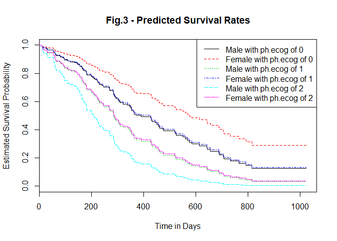<!-- -->

## Part 4 - Assessing Model Fit


```r
# Diagnostics (using bfit)

#  Cox-Snell residuals plot (FIG.4)
csresids <- lung.comp$status-residuals(bfit,"martingale")
fitres <- survfit(coxph(Surv(csresids, lung.comp$status)~1, method='breslow'), type='kaplan-meier')
plot(fitres$time,-log(fitres$surv),type='p', main="Fig.4 - Cox-Snell Residuals Plot", 
     xlab='Cox-Snell Residuals', ylab='Estimated Cumulative Hazard Function')
abline(0,1,col='red')
```

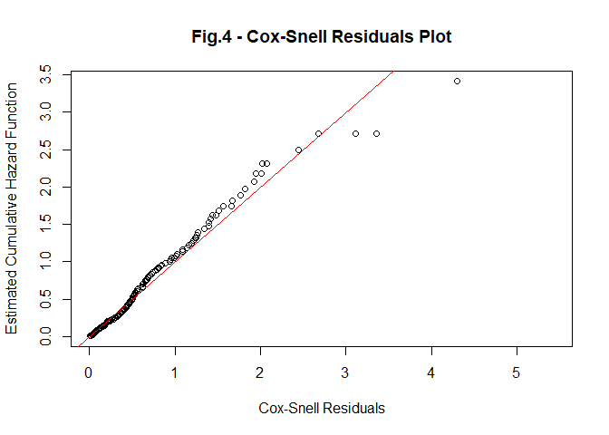<!-- -->

```r
# Martingale residuals plot (FIG.5)
mresids <- residuals(bfit, type="martingale")
plot(lung.comp$ph.ecog, mresids, main="Fig.5 - Martingale Residuals Plot", xlab="ph.ecog", 
     ylab="Martingale Residuals" )
lines(lowess(lung.comp$ph.ecog, mresids), col="red", lwd=2)
```

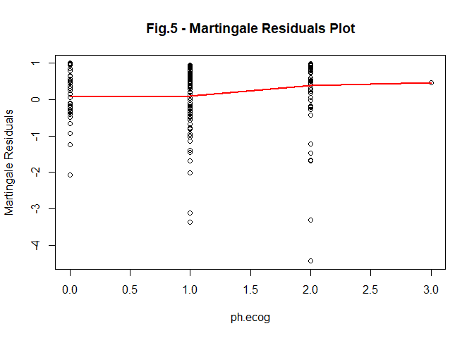<!-- -->

```r
# Score residuals plots (FIGS.6 & 7)
scoreresids <- residuals(bfit, type="score")
plot(lung.comp$time, scoreresids[,1], main="Fig.6 - Score Residuals Plot for Sex", 
     xlab="Time in Days", ylab="Score Residuals for Sex" )
```

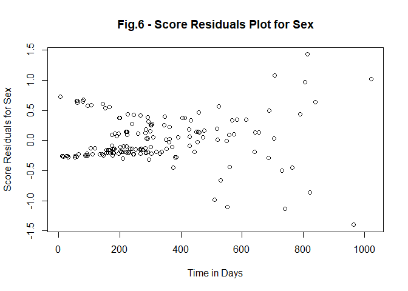<!-- -->

```r
plot(lung.comp$time, scoreresids[,2], main="Fig.7 - Score Residuals Plot for ph.ecog",
     xlab="Time in Days", ylab="Score Residuals for ph.ecog" )
cox.zph(bfit)
```

```
##                 rho chisq      p
## factor(sex)2  0.109  1.37 0.2411
## ph.ecog      -0.210  5.58 0.0182
## GLOBAL           NA  6.76 0.0340
```

```r
# Plot of KM estimated survival function for ph.ecog (FIG.8)
lung.comp1 <- lung.comp[lung.comp$ph.ecog!=3,] # remove sole observation for ph.ecog=3
kmsurvival1 <- survfit(Surv(time, status) ~ ph.ecog, data=lung.comp1)

ggsurvplot(kmsurvival1, data=lung.comp1, title="Fig.8 - Survival Function \nfor Physician's ECOG Score", xlab="Time in Days", ylab="Estimated Survival Probability", legend.labs = c("ph.ecog=0","ph.ecog=1", "ph.ecog=2"), risk.table = TRUE)
```

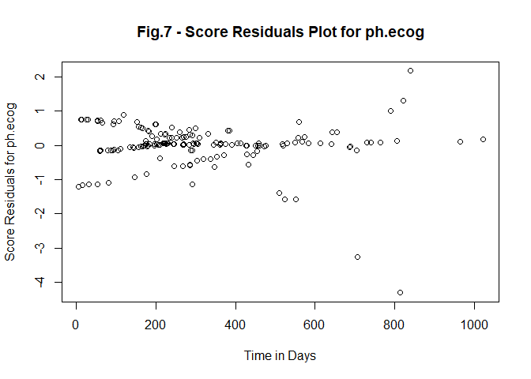<!-- -->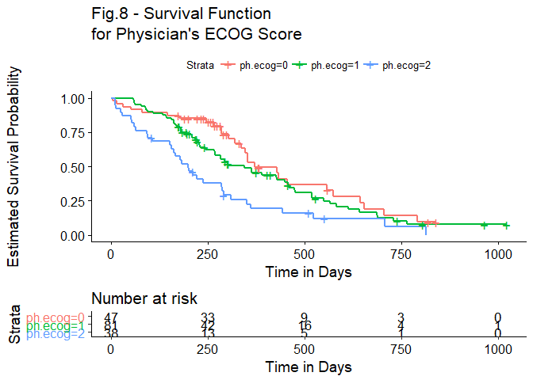<!-- -->

```r
# Plot of log(-log(S(t))) for ph.ecog (FIG.9)  
ggsurvplot(kmsurvival1, data=lung.comp1, fun="cloglog", title="Fig.9 - Log of Cumulative Hazard \nfor Physician's ECOG Score", xlab="log(Time in Days)", ylab="log-Cumulative Hazard", legend.labs = c("ph.ecog=0","ph.ecog=1", "ph.ecog=2"))
```

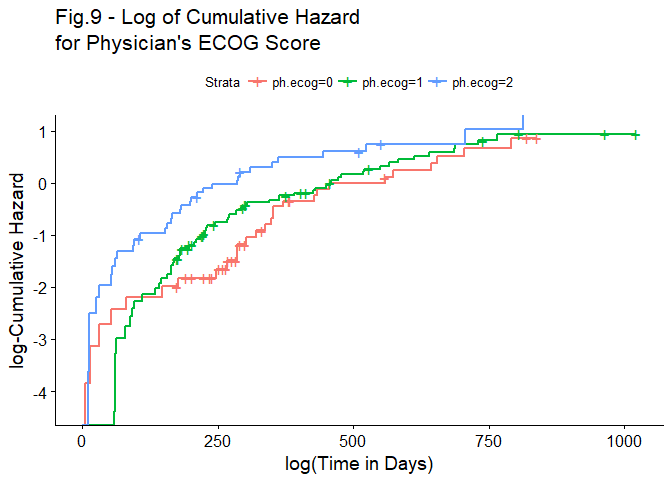<!-- -->

```r
# Deviance residuals plot (FIG.10)
dresids <- residuals(bfit, type="deviance")
plot(bfit$linear.predictors, dresids, main="Fig.10 - Deviance Residuals Plot",
     xlab="Linear Predictor", ylab="Deviance Residuals" )
identify(bfit$linear.predictors, dresids, labels=row.names(lung.comp))
```

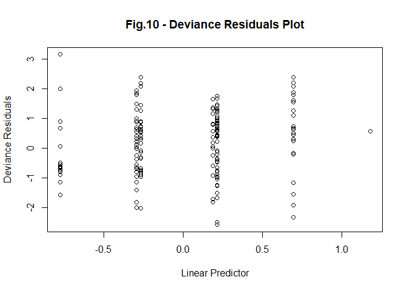<!-- -->

```
## integer(0)
```

```r
lung.comp[41,]
```

```
##    inst time status age sex ph.ecog ph.karno pat.karno meal.cal wt.loss
## 57    5    5      1  65   2       0      100        80      338       5
```

```r
survfit(bfit, newdata=data.frame(sex=2, ph.ecog=0))
```

```
## Call: survfit(formula = bfit, newdata = data.frame(sex = 2, ph.ecog = 0))
## 
##       n  events  median 0.95LCL 0.95UCL 
##     167     120     574     444      NA
```

```r
# Influential observations plot (FIG.11)
theta <- scoreresids%*%bfit$var%*%t(scoreresids)
lmax <- abs(eigen(theta)$vector[,1])
id <- as.numeric(rownames(lung.comp))
plot(id, lmax, main = "Fig.11 - Influential Observations Plot",
     xlab="Observation", ylab="Largest Eigenvalue Element")
identify(id, lmax, labels=row.names(lung.comp))
```

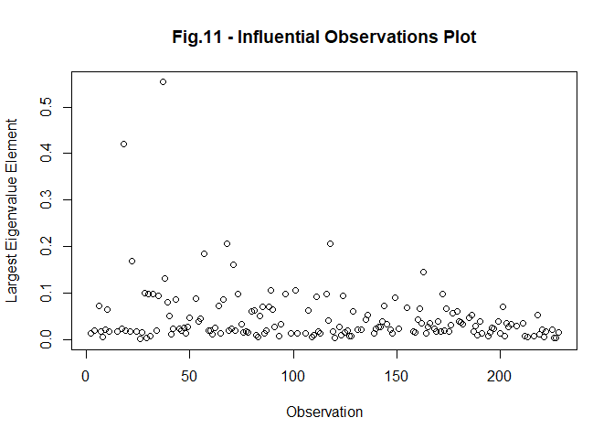<!-- -->

```
## integer(0)
```

```r
lung.comp[11,]
```

```
##    inst time status age sex ph.ecog ph.karno pat.karno meal.cal wt.loss
## 18   16  707      1  63   1       2       50        70     1025      22
```

```r
lung.comp[25,]
```

```
##    inst time status age sex ph.ecog ph.karno pat.karno meal.cal wt.loss
## 37   22  814      1  65   1       2       70        60      513      28
```

```r
survfit(bfit, newdata=data.frame(sex=1, ph.ecog=2))
```

```
## Call: survfit(formula = bfit, newdata = data.frame(sex = 1, ph.ecog = 2))
## 
##       n  events  median 0.95LCL 0.95UCL 
##     167     120     210     167     285
```

